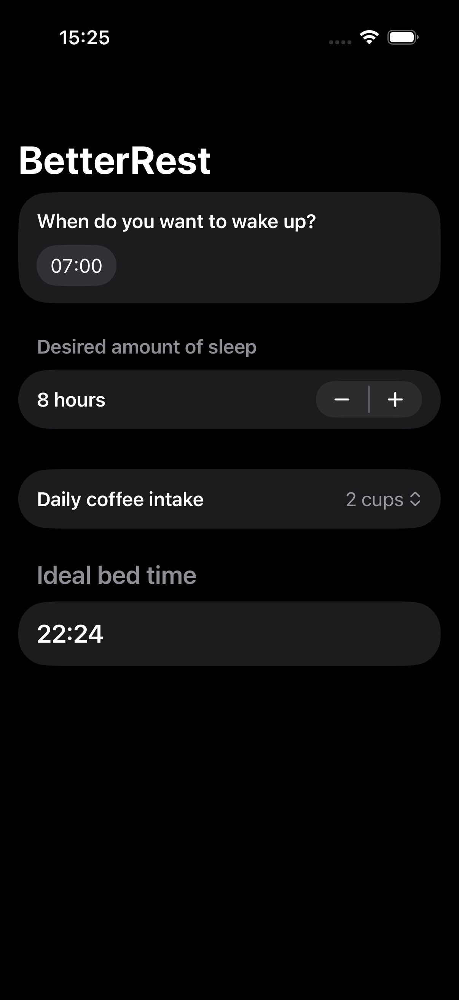

# BetterRest

SwiftUI application that predicts an ideal bedtime using a CoreML model based on wake-up time, desired sleep duration, and daily coffee intake.

## Overview

The app collects user input, converts it into values required by the CoreML model, runs a prediction, and displays the calculated bedtime.

## Technologies

- Swift
- SwiftUI
- CoreML

## Screenshot

  

## Demo

Short demo showing user input and CoreML prediction:

[Watch the demo on LinkedIn](https://www.linkedin.com/feed/update/urn:li:activity:7431709962340331520/)

## Learning Context

Built as part of the *Hacking with Swift – SwiftUI* course:
https://www.hackingwithswift.com/books/ios-swiftui

The implementation was written independently while following the course structure.
